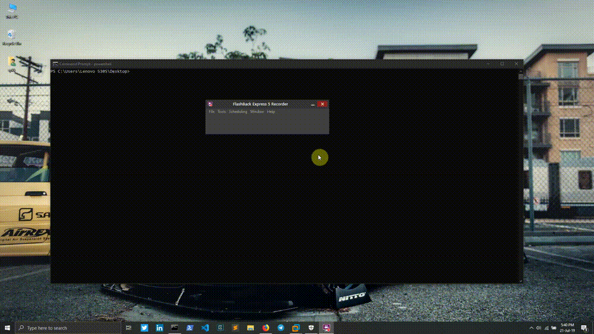

## What is Obfuse?
Obfuse is just a simple bash script that combines different methods into one executable, compiled with golang. It uses **Invoke-PowerShellTcp.ps1** from [Nishang](https://github.com/samratashok/nishang) for reverse connection which will be served with python http module, then it uses a compiled go binary which will download the script and execute it in memory. The purpose of Obfuse is to bypass AV.

## Requirements
- Metasploit Framework (msfconsole)
	- Available on the official repo **https://github.com/rapid7/metasploit-framework**
- Golang (GO)
	- You can install it by executing **apt-get install golang**
- Python (http server)
	- You can install it by executing **apt-get install python2 or python3**
- Wine
	- You can install it by executing **apt-get install wine or wine32**

## Usage
> $ ./obfuse.sh attacker_ip attacker_port malware_name.pdf

## Tips
Use the powershell method to download files if you already have access on the target machine because certutil might already be blocked and it might trigger an alert.

## Feedback and issues?
If you have any feedback, anything that you want to see implemented or if you're running into issues using Obfuse, please feel free to file an issue on [https://github.com/spenkk/obfuse/issues](https://github.com/spenkk/obfuse/issues)

## Disclaimer
I've created this tool for various penetration testing purposes and I'm not responsible for any misuse or damage caused by it.

## DEMO

